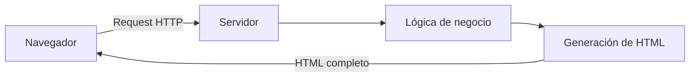
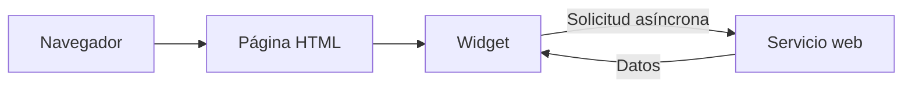
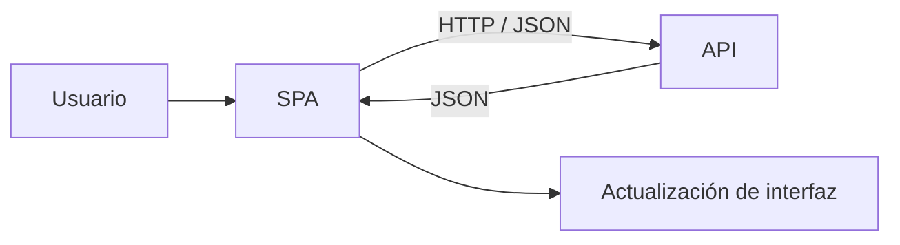
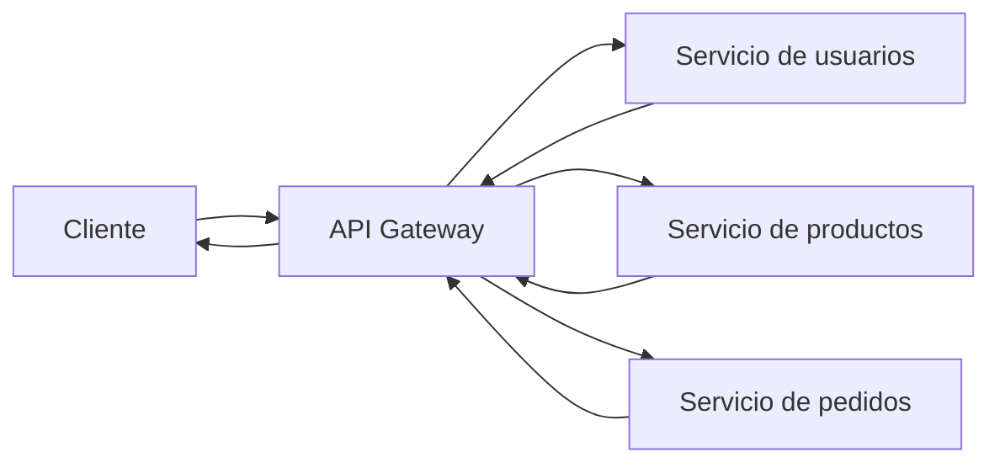
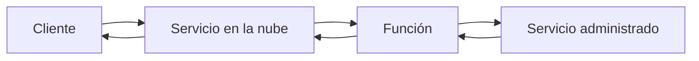

## README 04

:::writing{variant="document" id="63158" title="README - Ejemplo 04 Arquitecturas web"}
# Ejemplo 04 - Arquitecturas web

## Unidad 1 - Fundamentos de programación web

Este ejemplo permite reconocer diferentes formas de organizar una aplicación web y comprender cómo han evolucionado las responsabilidades del cliente y del servidor.

En este caso no se desarrolla una aplicación completa.

El objetivo es analizar visualmente diferentes arquitecturas y relacionarlas con tecnologías que aparecerán posteriormente en el curso.

---

# Objetivo de aprendizaje

Al finalizar este ejemplo, el estudiante estará en capacidad de:

- reconocer una aplicación web tradicional o legacy;
- comprender el concepto de actualización parcial mediante widgets;
- identificar una Single Page Application o SPA;
- reconocer la organización básica de una arquitectura basada en microservicios;
- comprender conceptualmente una arquitectura serverless;
- comparar las responsabilidades del cliente y del servidor;
- relacionar una SPA con APIs y servicios web;
- interpretar diagramas básicos de arquitectura.

---

# Estructura

```text
ejemplo04-arquitecturas-web/
│
├── README.md
│
└── diagramas/
    ├── 01-legacy.md
    ├── 02-widgets.md
    ├── 03-spa.md
    ├── 04-microservicios.md
    └── 05-serverless.md

    # Ejemplo 04 - Arquitecturas web

## Unidad 1 - Fundamentos de programación web

Este ejemplo permite reconocer diferentes formas de organizar una aplicación web y comprender cómo han evolucionado las responsabilidades del cliente y del servidor.

En este caso no se desarrolla una aplicación completa.

El objetivo es analizar visualmente diferentes arquitecturas y relacionarlas con tecnologías que aparecerán posteriormente en el curso.

---

# Objetivo de aprendizaje

Al finalizar este ejemplo, el estudiante estará en capacidad de:

* reconocer una aplicación web tradicional o legacy;
* comprender el concepto de actualización parcial mediante widgets;
* identificar una Single Page Application o SPA;
* reconocer la organización básica de una arquitectura basada en microservicios;
* comprender conceptualmente una arquitectura serverless;
* comparar las responsabilidades del cliente y del servidor;
* relacionar una SPA con APIs y servicios web;
* interpretar diagramas básicos de arquitectura.

---

# Estructura

```text
ejemplo04-arquitecturas-web/
│
├── README.md
│
└── diagramas/
    ├── 01-legacy.md
    ├── 02-widgets.md
    ├── 03-spa.md
    ├── 04-microservicios.md
    └── 05-serverless.md
```

---

# ¿Qué es una arquitectura web?

En este ejemplo utilizaremos el término **arquitectura web** para analizar cómo se organizan y se comunican las diferentes partes de una aplicación web.

Una aplicación puede distribuir sus responsabilidades de distintas maneras.

Por ejemplo:

* el servidor puede encargarse de generar completamente la interfaz;
* el navegador puede modificar partes de la interfaz utilizando JavaScript;
* el Front End puede comunicarse con una API;
* una solución puede estar dividida en varios servicios independientes;
* algunos componentes de infraestructura pueden ser administrados por un proveedor en la nube.

La arquitectura seleccionada depende de las necesidades de la aplicación.

---

# 1. Aplicación tradicional o legacy

Abra:

```text
diagramas/01-legacy.md
```

El diagrama representa una arquitectura en la que gran parte de la responsabilidad se encuentra en el servidor.



El flujo básico puede interpretarse así:

```text
NAVEGADOR
    │
    │ Request HTTP
    ▼
SERVIDOR
    │
    ├── procesa la lógica
    │
    └── genera el HTML
    │
    ▼
HTML COMPLETO
    │
    ▼
NAVEGADOR
```

En este tipo de arquitectura, el cliente solicita información y el servidor puede construir una página HTML completa antes de devolverla.

---

# ¿Qué ocurre cuando cambia la información?

En una aplicación tradicional, una modificación importante puede requerir una nueva solicitud al servidor.

Por ejemplo:

```text
Usuario
   │
   │ solicita nueva información
   ▼
Servidor
   │
   │ genera nuevamente HTML
   ▼
Navegador
```

Esto hace que el servidor tenga una responsabilidad importante en la construcción de la interfaz.

---

# Responsabilidad principal del servidor

En este modelo, el servidor puede encargarse de:

```text
lógica de negocio
procesamiento de solicitudes
acceso a datos
generación del HTML
```

El navegador principalmente recibe y representa el documento generado.

---

# 2. Aplicación con widgets

Abra:

```text
diagramas/02-widgets.md
```

El diagrama muestra:



En este modelo no siempre es necesario reemplazar toda la página.

Una parte específica de la interfaz puede solicitar nueva información.

---

# ¿Qué es un widget?

En este contexto, podemos pensar en un widget como una sección de la interfaz que puede actualizarse de manera independiente.

Por ejemplo, una página podría contener:

```text
┌────────────────────────────┐
│ Portal universitario       │
├────────────────────────────┤
│ Noticias                   │
├────────────────────────────┤
│ Clima                      │
├────────────────────────────┤
│ Calendario                 │
├────────────────────────────┤
│ Mensajes                   │
└────────────────────────────┘
```

Si solamente cambia la información del clima, no sería necesario reconstruir toda la página.

Podría actualizarse solamente:

```text
Clima
```

---

# Comunicación asíncrona

Conceptualmente puede ocurrir:

```text
PÁGINA
   │
   │ solicitud
   ▼
SERVICIO WEB
   │
   │ datos
   ▼
PARTE DE LA PÁGINA
```

JavaScript permite realizar este tipo de solicitudes sin necesariamente recargar por completo la página.

---

# Relación con AJAX

El módulo relaciona este tipo de aplicaciones con AJAX.

AJAX significa:

```text
Asynchronous JavaScript And XML
```

El concepto importante para este curso es la posibilidad de que JavaScript realice solicitudes al servidor de forma asíncrona y posteriormente actualice una parte de la interfaz.

Aunque el nombre incluye XML, actualmente también es muy frecuente utilizar JSON para intercambiar información.

---

# 3. SPA - Single Page Application

Abra:

```text
diagramas/03-spa.md
```

El diagrama representa:



SPA significa:

```text
Single Page Application
```

o:

```text
Aplicación de una sola página
```

---

# ¿Cómo funciona una SPA?

De manera simplificada:

```text
USUARIO
   │
   ▼
FRONT END
   │
   │ HTTP
   │ JSON
   ▼
API
   │
   │ JSON
   ▼
FRONT END
   │
   ▼
INTERFAZ ACTUALIZADA
```

La interfaz principal se encuentra en el cliente y JavaScript puede modificar lo que el usuario observa dependiendo de las acciones realizadas y de la información recibida desde un servidor.

---

# Diferencia conceptual con una aplicación tradicional

## Aplicación tradicional

```text
Cliente
   │
   ▼
Servidor
   │
   ├── ejecuta lógica
   └── genera HTML
   │
   ▼
Cliente recibe HTML
```

## SPA

```text
Cliente
   │
   ├── administra interfaz
   │
   │ HTTP / JSON
   ▼
API
```

En una SPA el navegador puede asumir una mayor responsabilidad sobre la interfaz.

---

# Relación con React

Posteriormente se estudiará React.

Una aplicación desarrollada con React puede utilizar una arquitectura similar a:

```text
React
   │
   │ Request HTTP
   ▼
API
   │
   │ Response JSON
   ▼
React
   │
   ▼
Actualización de interfaz
```

Esto permite relacionar la arquitectura con conceptos estudiados anteriormente:

```text
cliente
servidor
HTTP
Request
Response
JSON
```

---

# Ejemplo conceptual

Imagine una aplicación para consultar estudiantes.

El usuario abre una interfaz desarrollada con React.

React realiza:

```text
GET /estudiantes
```

El servidor responde:

```json
[
  {
    "id": 1,
    "nombre": "Ana"
  },
  {
    "id": 2,
    "nombre": "Carlos"
  }
]
```

React recibe la información y construye la interfaz.

---

# 4. Arquitectura basada en microservicios

Abra:

```text
diagramas/04-microservicios.md
```

El diagrama representa:



Una arquitectura basada en microservicios divide una solución en diferentes servicios especializados.

---

# Ejemplo de división por responsabilidades

Una aplicación de comercio electrónico podría contener:

```text
Servicio de usuarios

Servicio de productos

Servicio de pedidos

Servicio de pagos

Servicio de inventario
```

Cada servicio se concentra en un conjunto específico de responsabilidades.

---

# Representación simplificada

```text
                 ┌─────────────────────┐
                 │ Servicio usuarios   │
                 └─────────────────────┘
                           ▲
                           │
CLIENTE ──► API GATEWAY ───┼──► Servicio productos
                           │
                           ▼
                 ┌─────────────────────┐
                 │ Servicio pedidos    │
                 └─────────────────────┘
```

---

# ¿Qué ventaja conceptual presenta?

En lugar de tener:

```text
UNA APLICACIÓN
que hace absolutamente todo
```

se pueden tener:

```text
SERVICIO A
responsabilidad específica

SERVICIO B
responsabilidad específica

SERVICIO C
responsabilidad específica
```

Esto permite organizar responsabilidades de forma independiente.

---

# Tecnologías diferentes

El módulo resalta que diferentes microservicios pueden desarrollarse utilizando tecnologías distintas.

Por ejemplo:

```text
Servicio de usuarios
Java + Spring Boot

Servicio de análisis
Python

Servicio de notificaciones
JavaScript
```

La comunicación entre ellos puede establecerse mediante interfaces y protocolos definidos.

---

# API Gateway

El diagrama contiene:

```text
API Gateway
```

Conceptualmente actúa como punto de entrada para las solicitudes de los clientes.

Por ejemplo:

```text
GET /usuarios
      │
      ▼
API Gateway
      │
      ▼
Servicio de usuarios
```

Mientras:

```text
GET /productos
      │
      ▼
API Gateway
      │
      ▼
Servicio de productos
```

El API Gateway puede dirigir una solicitud hacia el servicio correspondiente.

---

# 5. Arquitectura serverless

Abra:

```text
diagramas/05-serverless.md
```

El diagrama representa:



El término:

```text
serverless
```

puede causar confusión.

No significa:

```text
no existen servidores
```

Los servidores siguen existiendo.

---

# ¿Qué significa entonces serverless?

Conceptualmente significa que el desarrollador delega una parte importante de la administración de la infraestructura a un proveedor.

El desarrollador puede concentrarse en la lógica que necesita ejecutar.

Por ejemplo:

```text
Evento
   │
   ▼
Función
   │
   ▼
Resultado
```

Mientras el proveedor administra aspectos relacionados con la infraestructura necesaria para ejecutar esa función.

---

# Relación con computación en la nube

Serverless está estrechamente relacionado con los servicios ofrecidos por plataformas de computación en la nube.

Este concepto será retomado posteriormente en la Unidad 5.

---

# Comparación general de las arquitecturas

| Arquitectura         | Característica principal                                                |
| -------------------- | ----------------------------------------------------------------------- |
| Tradicional o legacy | El servidor genera gran parte de la interfaz                            |
| Widgets              | Una parte específica de la página puede actualizarse                    |
| SPA                  | El cliente administra gran parte de la interfaz                         |
| Microservicios       | La solución se divide en servicios especializados                       |
| Serverless           | Parte importante de la infraestructura es administrada por un proveedor |

---

# ¿Una arquitectura reemplaza completamente a otra?

No necesariamente.

No debe interpretarse:

```text
legacy
   ↓
widgets
   ↓
SPA
   ↓
microservicios
   ↓
serverless
```

como si cada arquitectura nueva hiciera inútil automáticamente a la anterior.

La arquitectura adecuada depende de:

```text
problema que se quiere resolver
cantidad de usuarios
complejidad
infraestructura
costos
equipo de desarrollo
mantenimiento
necesidades de escalabilidad
```

---

# Arquitectura que aparecerá durante el curso

Una estructura especialmente importante será:

```text
USUARIO
   │
   ▼
REACT
Front End
   │
   │ HTTP
   │ JSON
   ▼
SPRING BOOT
Back End
   │
   ▼
BASE DE DATOS
```

Este esquema permitirá integrar diferentes unidades del curso.

---

# Front End

El Front End corresponde a la parte de la aplicación con la que interactúa directamente el usuario.

Puede encargarse de:

```text
interfaz
formularios
botones
presentación de información
interacción
```

En este curso se estudiará posteriormente React.

---

# Back End

El Back End puede encargarse de:

```text
procesamiento de solicitudes
lógica de negocio
acceso a información
persistencia
integración con otros servicios
```

Posteriormente se utilizará Spring Boot.

---

# API

La API puede actuar como medio de comunicación entre Front End y Back End.

Por ejemplo:

```text
React
   │
   │ GET /estudiantes
   ▼
Spring Boot
   │
   │ JSON
   ▼
React
```

Observe que aquí vuelven a aparecer conceptos estudiados anteriormente:

```text
GET
HTTP
Request
Response
JSON
```

---

# Integración de los ejemplos de la Unidad 1

Los ejemplos de esta unidad se relacionan de la siguiente manera:

```text
EJEMPLO 01
Cliente - servidor
      │
      ▼
EJEMPLO 02
HTTP
      │
      ▼
EJEMPLO 03
JSON / XML
      │
      ▼
EJEMPLO 04
Arquitecturas web
```

Primero se comprendió quién se comunica.

Después se estudió cómo se realiza la comunicación.

Posteriormente se analizaron formatos para representar la información.

Finalmente se observa cómo estos elementos pueden organizarse dentro de diferentes arquitecturas.

---

# Actividad 1. Identificar componentes

Analice una aplicación web que utilice frecuentemente.

Puede ser, por ejemplo:

```text
una plataforma académica
un correo electrónico web
una tienda en línea
una red social
una aplicación bancaria
```

Identifique conceptualmente:

1. qué elemento podría actuar como cliente;
2. dónde podría encontrarse el servidor;
3. qué información podría intercambiarse;
4. qué acciones pueden realizar solicitudes HTTP;
5. qué información podría recibirse en JSON.

---

# Actividad 2. Identificar una SPA

Seleccione una aplicación web moderna.

Observe si al realizar determinadas acciones:

```text
cambia contenido
aparecen nuevos datos
se modifican secciones
```

sin que aparentemente se recargue toda la página.

Explique por qué este comportamiento podría relacionarse con el concepto de SPA o actualización parcial de la interfaz.

---

# Actividad 3. Diseñar una arquitectura sencilla

Imagine una aplicación para gestionar una biblioteca.

Debe permitir:

```text
consultar libros
registrar libros
consultar usuarios
registrar préstamos
```

Proponga una arquitectura inicial que contenga:

```text
Cliente
Front End
Back End
Base de datos
```

Puede representarla así:

```text
USUARIO
   │
   ▼
FRONT END
   │
   ▼
BACK END
   │
   ▼
BASE DE DATOS
```

Agregue las tecnologías que considere apropiadas.

---

# Actividad 4. Relacionar tecnologías del curso

Considere:

```text
React
Spring Boot
Base de datos
```

Ubique cada tecnología dentro del siguiente esquema:

```text
USUARIO
   │
   ▼
_________________
   │
   │ HTTP / JSON
   ▼
_________________
   │
   ▼
_________________
```

Explique la función de cada componente.

---

# Reto - Diseñar microservicios

Imagine una plataforma académica que permita:

```text
gestionar estudiantes
gestionar docentes
gestionar cursos
gestionar matrículas
consultar calificaciones
```

Proponga una posible división en microservicios.

Por ejemplo:

```text
Servicio de estudiantes
Servicio de cursos
Servicio de matrículas
```

Para cada servicio indique:

1. qué responsabilidad tendría;
2. qué información administraría;
3. qué solicitudes podría recibir.

---

# Preguntas de análisis

Después de estudiar los diagramas, responda:

1. ¿Qué responsabilidad tiene el servidor en una aplicación web tradicional?
2. ¿Qué significa actualizar solamente una parte de una página?
3. ¿Qué significa AJAX?
4. ¿Qué significa SPA?
5. ¿Qué papel tiene JavaScript en una SPA?
6. ¿Cómo puede una SPA comunicarse con un servidor?
7. ¿Qué formato podría utilizarse para intercambiar información?
8. ¿Qué es un microservicio?
9. ¿Por qué pueden existir varios microservicios en una misma solución?
10. ¿Pueden utilizar tecnologías diferentes?
11. ¿Qué función conceptual cumple un API Gateway?
12. ¿Serverless significa que no existen servidores?
13. ¿Qué relación existe entre serverless y la computación en la nube?
14. ¿Qué papel podría cumplir React?
15. ¿Qué papel podría cumplir Spring Boot?
16. ¿Dónde podría encontrarse una base de datos dentro de la arquitectura?
17. ¿Cómo se relacionan HTTP y JSON con estas arquitecturas?

---

# Resultado esperado

Al finalizar este ejemplo debe poder interpretar esquemas como:

```text
CLIENTE
   │
   │ HTTP
   ▼
SERVIDOR
```

y también:

```text
FRONT END
   │
   │ HTTP / JSON
   ▼
API
   │
   ▼
BACK END
```

así como una arquitectura más amplia:

```text
USUARIO
   │
   ▼
REACT
   │
   │ HTTP / JSON
   ▼
SPRING BOOT
   │
   ▼
BASE DE DATOS
```

---

# Conceptos trabajados

En este ejemplo se abordaron:

* arquitectura web;
* aplicación tradicional;
* legacy;
* widgets;
* AJAX;
* solicitudes asíncronas;
* SPA;
* Front End;
* Back End;
* API;
* microservicios;
* API Gateway;
* serverless;
* computación en la nube;
* cliente;
* servidor;
* HTTP;
* JSON.

---

# Conclusión

Las aplicaciones web pueden organizarse de diferentes maneras.

En algunas arquitecturas, el servidor asume gran parte de la responsabilidad. En otras, el cliente administra una parte importante de la interfaz y se comunica con servicios mediante HTTP.

Las arquitecturas basadas en microservicios permiten distribuir responsabilidades entre varios servicios, mientras que las alternativas serverless delegan parte de la administración de infraestructura a proveedores especializados.

Los conceptos estudiados en este ejemplo permiten comprender mejor la arquitectura que se utilizará posteriormente al integrar un Front End desarrollado con React, un Back End desarrollado con Spring Boot y una base de datos.
