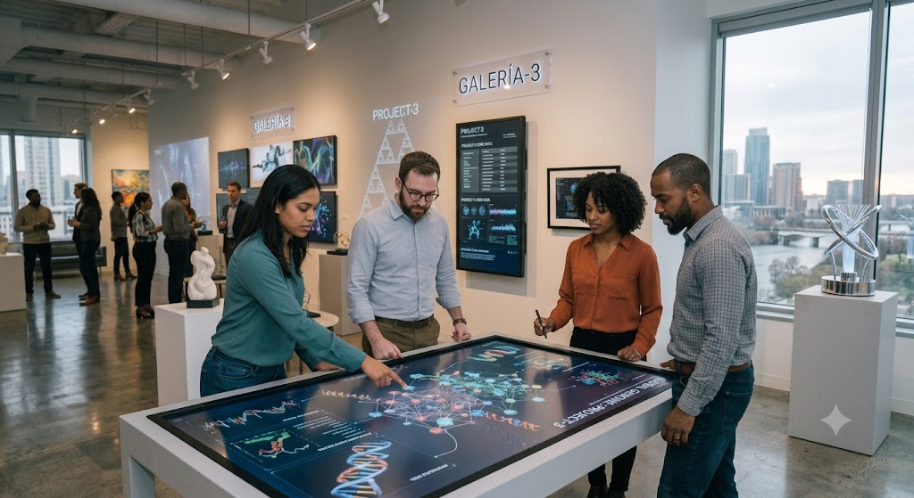

# Laboratorio 06: Organización de proyectos con Flexbox

**Nivel:** Básico–intermedio

**Duración estimada:** 50 minutos

**Requisitos previos:**

- Laboratorio 01: Vinculación de la hoja de estilos.
- Laboratorio 02: Construcción de la identidad visual.
- Laboratorio 03: Organización del contenido mediante el modelo de caja.
- Laboratorio 04: Construcción de componentes visuales.
- Laboratorio 05: Diseño del menú de navegación.
- Contar con la versión completa del Proyecto Web Personal.

**Concepto principal:**

Utilizar Flexbox para organizar las tarjetas de proyectos dentro de un contenedor flexible.

---

# Objetivo

Organizar la sección de proyectos del Proyecto Web Personal mediante Flexbox, permitiendo que las tarjetas se distribuyan horizontalmente y se adapten al espacio disponible.

---

# Descripción

Hasta el laboratorio anterior, el Proyecto Web Personal cuenta con:

- Identidad visual.
- Modelo de caja.
- Componentes reutilizables.
- Tarjetas.
- Menú de navegación interactivo.

Sin embargo, las tarjetas de proyectos todavía siguen el flujo normal del documento y aparecen una debajo de la otra.

En este laboratorio se utilizará **Flexbox** para organizar los proyectos de manera más flexible.

Para ello se incorporará un nuevo contenedor en el documento HTML:

```html
<div class="contenedor-proyectos">
```

Dentro de este contenedor se ubicarán las tarjetas de los proyectos.

En la hoja de estilos se aplicarán propiedades como:

- `display: flex`
- `flex-wrap`
- `gap`
- `flex`

Estas propiedades permitirán distribuir las tarjetas horizontalmente, mantener una separación uniforme y moverlas automáticamente a una nueva fila cuando el espacio disponible sea insuficiente.

---

# Evolución del proyecto

Hasta este momento el Proyecto Web Personal incluye:

- ✅ Hoja de estilos externa.
- ✅ Identidad visual.
- ✅ Paleta de colores.
- ✅ Variables CSS.
- ✅ Modelo de caja.
- ✅ Componentes visuales reutilizables.
- ✅ Tarjetas.
- ✅ Contenedores centrados.
- ✅ Menú de navegación moderno.
- ✅ Pseudo-clases.
- ✅ Transiciones y efectos de interacción.

Después de este laboratorio contará con:

- ✅ Contenedor flexible para proyectos.
- ✅ Tarjetas distribuidas horizontalmente.
- ✅ Separación uniforme entre proyectos.
- ✅ Ajuste automático a nuevas filas.
- ✅ Tamaños flexibles.
- ✅ Distribución adaptable al espacio disponible.
- ✅ Selectores descendientes.

Próximamente se incorporarán:

- ⏳ Galería organizada mediante Grid.
- ⏳ Formularios visualmente mejorados.
- ⏳ Diseño adaptable mediante media queries.
- ⏳ Revisión y publicación final.

---

# Competencia

Al finalizar este laboratorio, el estudiante será capaz de utilizar Flexbox para organizar componentes dentro de un contenedor y construir distribuciones flexibles que respondan al espacio disponible.

---

# Conceptos trabajados

- Flexbox.
- Contenedor flexible.
- Elementos flexibles.
- `display: flex`
- `flex-wrap`
- `gap`
- `flex`
- `flex-grow`
- `flex-shrink`
- `flex-basis`
- Selectores descendientes.
- Distribución horizontal.
- Adaptación al espacio disponible.

---

# ¿Qué es Flexbox?

Flexbox es un modelo de distribución de CSS diseñado para organizar elementos dentro de un contenedor.

Su nombre proviene de:

```text
Flexible Box Layout
```

Flexbox facilita tareas como:

- Distribuir elementos horizontalmente.
- Distribuir elementos verticalmente.
- Controlar el espacio entre elementos.
- Permitir que los componentes cambien de tamaño.
- Mover elementos a otra fila cuando no existe espacio suficiente.
- Alinear contenido dentro de un contenedor.

En este laboratorio se utilizará Flexbox para organizar las tarjetas de proyectos.

---

# Contenedor y elementos flexibles

Flexbox se compone de dos elementos principales:

1. El **contenedor flexible**.
2. Los **elementos flexibles**.

Ejemplo:

```html
<div class="contenedor-proyectos">

    <article>
        Proyecto 1
    </article>

    <article>
        Proyecto 2
    </article>

    <article>
        Proyecto 3
    </article>

</div>
```

En este caso:

- `.contenedor-proyectos` es el contenedor flexible.
- Cada `<article>` es un elemento flexible.

---

# Cambio en el documento HTML

En los laboratorios anteriores, los artículos de proyectos se encontraban directamente dentro de la sección:

```html
<section class="card" id="proyectos">

    <h2>Proyectos</h2>

    <article>
        Proyecto 1
    </article>

    <article>
        Proyecto 2
    </article>

    <article>
        Proyecto 3
    </article>

</section>
```

En este laboratorio se agrega un contenedor:

```html
<section class="card" id="proyectos">

    <h2>Proyectos</h2>

    <p>
        En esta sección se presentan algunos de los proyectos
        desarrollados durante el proceso de formación.
    </p>

    <div class="contenedor-proyectos">

        <article>

            <h3>Proyecto 1</h3>

            <figure>

                

                <figcaption>
                    Descripción breve del primer proyecto.
                </figcaption>

            </figure>

            <p>
                Explique el propósito y las principales
                características del proyecto.
            </p>

        </article>

        <article>

            <h3>Proyecto 2</h3>

            <figure>

                

                <figcaption>
                    Descripción breve del segundo proyecto.
                </figcaption>

            </figure>

            <p>
                Explique el propósito y las principales
                características del proyecto.
            </p>

        </article>

        <article>

            <h3>Proyecto 3</h3>

            <figure>

                

                <figcaption>
                    Descripción breve del tercer proyecto.
                </figcaption>

            </figure>

            <p>
                Explique el propósito y las principales
                características del proyecto.
            </p>

        </article>

    </div>

</section>
```

Este contenedor agrupa únicamente las tarjetas que serán organizadas mediante Flexbox.

---

# Activación de Flexbox

Flexbox se activa mediante:

```css
.contenedor-proyectos {
    display: flex;
}
```

La declaración:

```css
display: flex;
```

convierte al elemento en un contenedor flexible.

Sus hijos directos se convierten automáticamente en elementos flexibles.

En este caso, los tres artículos ubicados dentro de `.contenedor-proyectos` pasan a formar parte de la distribución Flexbox.

---

# Dirección principal

De forma predeterminada, Flexbox distribuye los elementos horizontalmente.

Esto equivale a:

```css
flex-direction: row;
```

Aunque esta propiedad no se escribe de manera explícita en el laboratorio, el navegador utiliza `row` como valor predeterminado.

Por esta razón, las tarjetas intentan ubicarse una al lado de la otra.

---

# Flex-wrap

La propiedad `flex-wrap` permite que los elementos pasen a una nueva fila cuando no existe suficiente espacio.

```css
.contenedor-proyectos {
    flex-wrap: wrap;
}
```

Sin esta propiedad, Flexbox intentaría conservar todos los elementos dentro de una única fila.

Con:

```css
flex-wrap: wrap;
```

las tarjetas pueden reorganizarse automáticamente.

---

# Gap

La propiedad `gap` define el espacio entre los elementos flexibles.

```css
.contenedor-proyectos {
    gap: 20px;
}
```

Esto agrega una separación uniforme de `20px` entre las tarjetas.

Utilizar `gap` evita tener que aplicar márgenes diferentes a cada elemento.

---

# Margen superior

El contenedor utiliza:

```css
margin-top: 20px;
```

Esta regla crea una separación entre el texto introductorio de la sección y las tarjetas de proyectos.

---

# Contenedor de proyectos

La configuración completa del contenedor es:

```css
.contenedor-proyectos {
    display: flex;
    flex-wrap: wrap;
    gap: 20px;
    margin-top: 20px;
}
```

Cada propiedad cumple una función:

| Propiedad | Función |
|-----------|---------|
| `display: flex` | Activa Flexbox. |
| `flex-wrap: wrap` | Permite pasar elementos a una nueva fila. |
| `gap: 20px` | Agrega separación entre tarjetas. |
| `margin-top: 20px` | Separa el contenedor del contenido anterior. |

---

# La propiedad flex

Las tarjetas utilizan:

```css
.contenedor-proyectos article {
    flex: 1 1 300px;
}
```

`flex` es una propiedad abreviada que representa:

```css
flex-grow: 1;
flex-shrink: 1;
flex-basis: 300px;
```

---

# Flex-grow

El primer valor representa `flex-grow`.

```css
flex-grow: 1;
```

Este valor indica que la tarjeta puede crecer para aprovechar el espacio disponible.

Cuando existe espacio adicional, las tarjetas pueden expandirse de manera proporcional.

---

# Flex-shrink

El segundo valor representa `flex-shrink`.

```css
flex-shrink: 1;
```

Este valor permite que la tarjeta reduzca su tamaño cuando el espacio disponible sea menor.

---

# Flex-basis

El tercer valor representa `flex-basis`.

```css
flex-basis: 300px;
```

Este valor establece el tamaño base esperado para cada tarjeta antes de distribuir el espacio disponible.

En este proyecto, cada tarjeta intenta tener aproximadamente `300px` de ancho.

Cuando varias tarjetas no caben en la misma fila, `flex-wrap` permite que pasen a una nueva línea.

---

# Interpretación de flex

La regla:

```css
flex: 1 1 300px;
```

puede interpretarse así:

> La tarjeta intenta tener un tamaño base de 300 píxeles, puede crecer para aprovechar el espacio disponible y puede reducirse cuando sea necesario.

No es necesario memorizar inmediatamente los tres valores.

Lo importante es comprender que esta configuración permite construir tarjetas flexibles.

---

# Selector descendiente

Las tarjetas se seleccionan mediante:

```css
.contenedor-proyectos article {
    flex: 1 1 300px;
}
```

Este es un selector descendiente.

Selecciona todos los elementos `<article>` que se encuentren dentro de un elemento con la clase `.contenedor-proyectos`.

No afecta los demás artículos del documento.

Por ejemplo, el artículo **Estado del proyecto** no recibe esta regla porque no está dentro del contenedor de proyectos.

---

# Diseño de las tarjetas de proyecto

Además de participar en la distribución flexible, los artículos incorporan una apariencia propia:

```css
.contenedor-proyectos article {
    flex: 1 1 300px;

    background-color: var(--color-superficie);
    border: 1px solid var(--color-borde);
    border-radius: 10px;
    padding: 20px;
}
```

Estas reglas agregan:

- Fondo blanco.
- Borde.
- Esquinas redondeadas.
- Espaciado interno.

Esto permite distinguir cada proyecto como una tarjeta independiente.

---

# Imágenes de los proyectos

Las imágenes ubicadas dentro de las tarjetas utilizan:

```css
.contenedor-proyectos img {
    width: 100%;
}
```

Esto permite que la imagen ocupe todo el ancho disponible dentro de su tarjeta.

También se conserva:

```css
img {
    max-width: 100%;
    height: auto;
}
```

La propiedad:

```css
height: auto;
```

mantiene la proporción original de la imagen.

---

# Encabezados y pies internos

El documento contiene encabezados y pies dentro del artículo **Estado del proyecto**.

Para evitar que estos elementos reciban los estilos de los contenedores principales se utilizan selectores específicos:

```css
body > header
```

```css
body > footer
```

Los elementos internos se restablecen mediante:

```css
article > header,
article > footer {
    background-color: transparent;
    padding: 0;
    margin: 0;
    border-radius: 0;
    box-shadow: none;
}
```

---

# Hoja de estilos del laboratorio

```css
/* =======================================================
   RESET
======================================================= */

* {
    margin: 0;
    padding: 0;
    box-sizing: border-box;
}


/* =======================================================
   VARIABLES
======================================================= */

:root {
    --color-primario: #1f3c5c;
    --color-secundario: #0056b3;

    --color-fondo: #f4f4f4;
    --color-superficie: #ffffff;
    --color-tarjeta: #fafafa;

    --color-texto: #222222;
    --color-borde: #dddddd;
}


/* =======================================================
   ESTILOS GENERALES
======================================================= */

body {
    font-family: Arial, sans-serif;
    background-color: var(--color-fondo);
    color: var(--color-texto);
    line-height: 1.6;
}


/* =======================================================
   CONTENEDORES PRINCIPALES
======================================================= */

body > header,
main,
body > footer {
    max-width: 1200px;
    margin: 30px auto;
}


/* =======================================================
   ENCABEZADO PRINCIPAL
======================================================= */

body > header {
    background-color: var(--color-superficie);
    padding: 30px;
    border-radius: 12px;
    box-shadow: 0 4px 12px rgba(0, 0, 0, 0.10);
}


/* =======================================================
   NAVEGACIÓN
======================================================= */

nav {
    margin-top: 25px;
}

nav a {
    display: inline-block;
    margin-right: 8px;
    margin-bottom: 8px;
    padding: 10px 18px;

    color: #ffffff;
    background-color: var(--color-secundario);

    text-decoration: none;
    border-radius: 8px;

    transition:
        background-color 0.3s,
        transform 0.2s,
        box-shadow 0.2s;
}

nav a:visited {
    color: #ffffff;
}

nav a:hover {
    background-color: var(--color-primario);
    transform: translateY(-2px);
    box-shadow: 0 3px 8px rgba(0, 0, 0, 0.15);
}

nav a:active {
    transform: scale(0.98);
}


/* =======================================================
   CONTENIDO PRINCIPAL
======================================================= */

main {
    background-color: var(--color-superficie);
    padding: 30px;
    border-radius: 12px;
    box-shadow: 0 4px 12px rgba(0, 0, 0, 0.10);
}


/* =======================================================
   TIPOGRAFÍA
======================================================= */

h1,
h2,
h3 {
    color: var(--color-primario);
    margin-bottom: 15px;
}

p {
    margin-bottom: 15px;
}


/* =======================================================
   TARJETAS
======================================================= */

.card {
    background-color: var(--color-tarjeta);
    border: 1px solid var(--color-borde);
    border-radius: 10px;
    padding: 25px;
    margin-bottom: 30px;
}


/* =======================================================
   FLEXBOX: CONTENEDOR DE PROYECTOS
======================================================= */

.contenedor-proyectos {
    display: flex;
    flex-wrap: wrap;
    gap: 20px;
    margin-top: 20px;
}


/* =======================================================
   FLEXBOX: TARJETAS DE PROYECTO
======================================================= */

.contenedor-proyectos article {
    flex: 1 1 300px;

    background-color: var(--color-superficie);
    border: 1px solid var(--color-borde);
    border-radius: 10px;
    padding: 20px;
}


/* =======================================================
   TABLAS
======================================================= */

table {
    width: 100%;
    margin-top: 15px;
    border-collapse: collapse;
}

caption {
    margin-bottom: 10px;
    font-weight: bold;
}

th,
td {
    padding: 12px;
    text-align: left;
    border: 1px solid var(--color-borde);
}

th {
    background-color: var(--color-primario);
    color: #ffffff;
}


/* =======================================================
   LISTAS
======================================================= */

ul,
ol,
dl {
    margin-left: 25px;
    margin-bottom: 20px;
}

li {
    margin-bottom: 8px;
}

dt {
    margin-top: 12px;
    font-weight: bold;
}

dd {
    margin-left: 20px;
    margin-bottom: 10px;
}


/* =======================================================
   FORMULARIOS
======================================================= */

form {
    margin-top: 20px;
}

label {
    display: inline-block;
    margin-bottom: 6px;
}

input,
textarea,
select {
    width: 100%;
    padding: 10px;
    margin-bottom: 15px;

    font: inherit;

    border: 1px solid var(--color-borde);
    border-radius: 6px;
}

input[type="checkbox"] {
    width: auto;
    margin-right: 6px;
}

textarea {
    resize: vertical;
}


/* =======================================================
   BOTONES
======================================================= */

button {
    padding: 12px 20px;
    margin-right: 8px;

    font: inherit;
    color: #ffffff;
    background-color: var(--color-secundario);

    border: none;
    border-radius: 8px;

    cursor: pointer;

    transition: background-color 0.3s;
}

button:hover {
    background-color: var(--color-primario);
}


/* =======================================================
   IMÁGENES Y MULTIMEDIA
======================================================= */

img,
video,
audio {
    max-width: 100%;
}

img {
    height: auto;
    margin-top: 15px;
    margin-bottom: 20px;
    border-radius: 10px;
}

.contenedor-proyectos img {
    width: 100%;
}

video,
audio {
    margin-top: 15px;
}


/* =======================================================
   ELEMENTOS AVANZADOS
======================================================= */

details {
    margin-bottom: 15px;
}

summary {
    font-weight: bold;
    cursor: pointer;
}

progress,
meter {
    width: 100%;
    margin-top: 10px;
}


/* =======================================================
   ENCABEZADO Y PIE INTERNOS DE ARTÍCULOS
======================================================= */

article > header,
article > footer {
    background-color: transparent;
    padding: 0;
    margin: 0;
    border-radius: 0;
    box-shadow: none;
}


/* =======================================================
   PIE DE PÁGINA PRINCIPAL
======================================================= */

body > footer {
    background-color: var(--color-superficie);
    padding: 30px;
    border-radius: 12px;
    box-shadow: 0 4px 12px rgba(0, 0, 0, 0.10);
}


/* =======================================================
   SEPARADORES
======================================================= */

hr {
    margin: 30px 0;
    border: none;
    border-top: 1px solid var(--color-borde);
}
```

---

# Funcionamiento del laboratorio

Durante esta práctica, el estudiante:

1. Conserva los estilos desarrollados anteriormente.
2. Agrega el contenedor `.contenedor-proyectos` en el documento HTML.
3. Activa Flexbox mediante `display: flex`.
4. Permite el salto de elementos mediante `flex-wrap`.
5. Define separación uniforme mediante `gap`.
6. Aplica la propiedad `flex` a las tarjetas.
7. Utiliza un selector descendiente.
8. Comprueba cómo las tarjetas se distribuyen horizontalmente.
9. Reduce el ancho de la ventana y observa el cambio de fila.
10. Analiza cómo los elementos aprovechan el espacio disponible.

---

# Archivos

| Archivo o carpeta | Descripción |
|-------------------|-------------|
| `index.html` | Sexta versión del Proyecto Web con CSS. |
| `style.css` | Hoja de estilos con la distribución Flexbox. |
| `README.md` | Documentación del laboratorio. |
| `img/` | Recursos gráficos utilizados por el sitio. |
| `multimedia/` | Archivos de audio y video. |

---

# Cómo ejecutar el laboratorio

1. Abra la carpeta `css/06-flexbox`.
2. Ejecute el archivo `index.html`.
3. Localice la sección **Proyectos**.
4. Compruebe que las tarjetas se distribuyan horizontalmente.
5. Reduzca progresivamente el ancho de la ventana.
6. Observe cuándo una tarjeta pasa a la siguiente fila.
7. Modifique temporalmente el valor de `gap`.
8. Cambie el valor base de `300px` en la propiedad `flex`.
9. Guarde los cambios y actualice el navegador.
10. Restaure una configuración equilibrada.

---

# Buenas prácticas

- Aplicar Flexbox únicamente al contenedor que necesita distribución.
- Evitar utilizar `display: flex` en todo el documento sin una razón.
- Utilizar `gap` para mantener separaciones uniformes.
- Permitir el salto de elementos mediante `flex-wrap`.
- Definir tamaños base razonables.
- Mantener el contenido legible dentro de las tarjetas.
- Utilizar selectores específicos.
- Evitar modificar innecesariamente la estructura HTML.
- Probar el resultado en diferentes anchos de ventana.
- Mantener Flexbox enfocado en distribuciones de una dimensión.

---

# Reto

Experimente con la distribución Flexbox de las tarjetas de proyectos.

Puede:

1. Cambiar el valor de `gap`.
2. Cambiar el tamaño base de `300px`.
3. Modificar `flex-grow`.
4. Modificar `flex-shrink`.
5. Agregar un cuarto proyecto.
6. Observar cómo se reorganizan las tarjetas.
7. Cambiar temporalmente la dirección mediante `flex-direction`.
8. Comparar el resultado con el flujo normal del documento.

Después de experimentar, conserve una distribución equilibrada y legible.

---

# Resultado esperado

Al finalizar el laboratorio, el Proyecto Web Personal deberá:

- Conservar los estilos desarrollados anteriormente.
- Contar con un contenedor flexible para los proyectos.
- Mostrar las tarjetas distribuidas horizontalmente cuando exista espacio.
- Permitir que las tarjetas pasen a otra fila.
- Mantener una separación uniforme.
- Ajustar el tamaño de las tarjetas al espacio disponible.
- Conservar los demás componentes sin alteraciones.
- Estar preparado para organizar la galería mediante Grid.

---

# Conclusiones

Flexbox permite organizar componentes de manera flexible dentro de un contenedor.

Las propiedades `display`, `flex-wrap`, `gap` y `flex` facilitan la construcción de distribuciones que aprovechan el espacio disponible.

El uso de un contenedor específico evita afectar otras secciones del sitio.

Flexbox resulta especialmente útil para organizar elementos en una dimensión, ya sea horizontal o verticalmente.

En este laboratorio se utilizó para distribuir las tarjetas de proyectos sin modificar el contenido de las demás secciones.

---

# ¿Qué sigue?

En el siguiente laboratorio se utilizará **CSS Grid** para organizar la galería de imágenes.

Se incorporarán:

- `display: grid`
- `grid-template-columns`
- `repeat()`
- `minmax()`
- `auto-fit`
- `gap`
- Distribución en filas y columnas.

Así se podrá comparar el uso de Flexbox en la sección de proyectos con Grid en la galería.